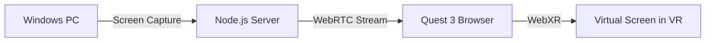

# Simplified Virtual Desktop for Quest 3

A local WebXR-based solution to stream your Windows PC desktop to your bootloaded Quest 3 over WiFi.

## User Review Required

> [!IMPORTANT]
> **MS Mixed Reality Link Limitation**: The Mixed Reality Link feature on Windows 11 is designed for 2D desktop viewing within Meta's ecosystem. Since your Quest 3 is bootloaded without Meta's Virtual Desktop app, we'll use an alternative approach.

> [!WARNING]
> **Two Viable Approaches - Your Choice Needed:**
> 1. **ALVR (Recommended for VR Gaming)** - Free, open-source PCVR streaming. Requires SteamVR installation and sideloading an APK. More complex setup but industry-proven.
> 2. **WebXR Custom Solution (Simpler, Desktop-Only)** - Build a lightweight web-based screen viewer. No APK needed - works in Quest browser. Perfect for your "just display my screen" use case.

## Recommended Approach: WebXR + WebRTC

Given your requirements (just desktop viewing with ultrawide resizing, no gaming), I recommend Option 2.

### Architecture



**How it works:**
1. **PC Server**: A Node.js app captures your screen using `getDisplayMedia()` and streams via WebRTC
2. **Quest Client**: A WebXR page (A-Frame) renders the stream on a virtual curved screen
3. **Local WiFi**: Both devices on same network, signaling via WebSocket

---

## Proposed Changes

### Component 1: PC Streaming Server

#### [NEW] [server.js](file:///e:/code2/VR/virtual-desktop/server/server.js)
- Express + WebSocket server for signaling
- Serves the streaming page and handles WebRTC offer/answer exchange
- Runs on port 3000

#### [NEW] [package.json](file:///e:/code2/VR/virtual-desktop/server/package.json)
- Dependencies: `express`, `ws`, `uuid`

#### [NEW] [streamer.html](file:///e:/code2/VR/virtual-desktop/server/public/streamer.html)
- Web page to open on PC browser (Chrome recommended)
- Initiates `getDisplayMedia()` for screen capture
- Establishes WebRTC peer connection to Quest

---

### Component 2: Quest VR Client

#### [NEW] [index.html](file:///e:/code2/VR/virtual-desktop/client/index.html)
- Main entry page with connection form
- Prompts for PC's local IP address

#### [NEW] [vr-desktop.html](file:///e:/code2/VR/virtual-desktop/client/vr-desktop.html)
- A-Frame WebXR scene
- Curved virtual screen (16:9 default, resizable to 21:9 or 32:9 ultrawide)
- Hand tracking controls for screen positioning and scaling
- "Enter VR" button to activate immersive mode

#### [NEW] [js/webrtc-client.js](file:///e:/code2/VR/virtual-desktop/client/js/webrtc-client.js)
- WebRTC receiver implementation
- Handles video stream and applies to A-Frame material

#### [NEW] [js/screen-controls.js](file:///e:/code2/VR/virtual-desktop/client/js/screen-controls.js)
- UI controls for:
  - Screen aspect ratio (16:9 → 21:9 → 32:9)
  - Screen distance/size
  - Screen curvature toggle

#### [NEW] [css/style.css](file:///e:/code2/VR/virtual-desktop/client/css/style.css)
- Dark theme styling for control panels

---

## Verification Plan

### Automated Tests
None applicable - this is a visual streaming application requiring real hardware.

### Manual Verification

**Step 1: Server Test (PC)**
```bash
cd e:\code2\VR\virtual-desktop\server
npm install
npm start
```
- Open `http://localhost:3000/streamer.html` in Chrome
- Verify screen sharing prompt appears
- Check console for "Server running on port 3000"

**Step 2: Client Test (Quest Browser)**
1. Note your PC's local IP (e.g., `192.168.1.x`)
2. In Quest browser, navigate to `http://[PC_IP]:3000/`
3. Enter the PC's IP and click "Connect"
4. Verify video stream appears on virtual screen
5. Click "Enter VR" to go immersive
6. Test ultrawide aspect ratio buttons (21:9, 32:9)

**Step 3: Full VR Experience**
- Verify screen is readable at comfortable distance
- Test screen distance/size controls
- Confirm low latency (should be <100ms on good WiFi)

---

## Alternative: ALVR Setup (If WebXR Doesn't Meet Needs)

If you later want full VR gaming with Mixed Reality:

1. Download [ALVR](https://github.com/alvr-org/ALVR/releases) server for Windows
2. Sideload [ALVR client APK](https://github.com/alvr-org/ALVR/releases) to Quest 3
3. Install SteamVR on PC
4. Configure ALVR Dashboard → enable "Desktop mode" for simple screen viewing
